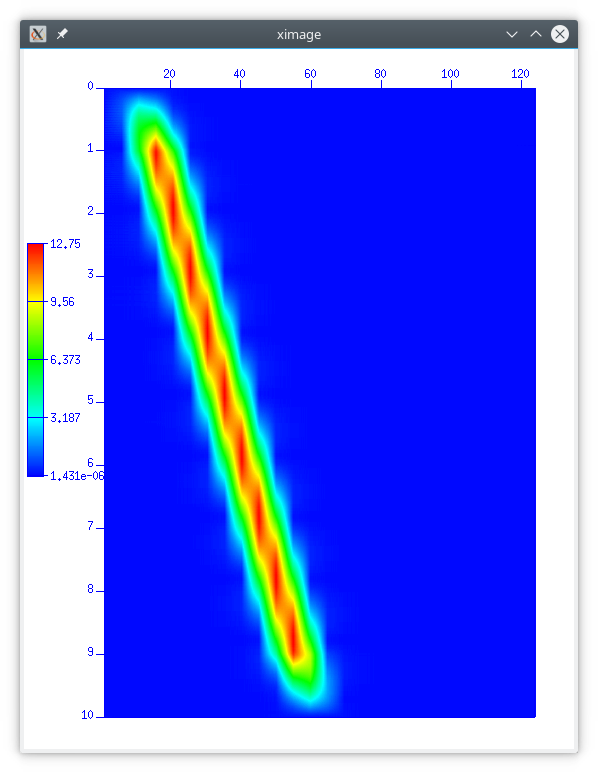

# SUSDFT                                                                       
Time-frequency decomposition by the sliding discrete fourier transform         
                                                                               
## Usage                                                                       
   susdft < stdin > stdout                                                     
                                                                               
### Required Parameters                                                        
| Parameter | Description                                     | Default       |
|:---------:| ----------------------------------------------- |:-------------:|
| dt=       | time sampling interval (sec)                    | trcheader     |
                                                                               
### Optional Parameters                                                        
| Parameter | Description                                     | Default       |
|:---------:| ----------------------------------------------- |:-------------:|
| nwin=     | number (odd) of samples in SDFT window          | 31            |
| mode=     | complex - output complex spectra                | complex       |
|           | amp - output spectral amplitude                 |               |
|           | phase - output spectral phase                   |               |
|           | real - output real part                         |               |
|           | imag - output imaginary part                    |               |
| window=   | none - no window applied to each data segment   | none          |
|           | hann - Hann window                              |               |
|           | hamming - Hamming window                        |               |
|           | blackman - Blackman window                      |               |
| verbose=  | 0 - no advisory messages, 1 - for messages      | 0             |
                                                                               
## Notes                                                                       
This process calculates a time-frequency decomposition of seismic data using 
the sliding discrete fourier transform.                                        
                                                                               
## Examples: 
   suvibro | susdft nwin=51 mode=amp window=hann | suximage 
 
  
 
